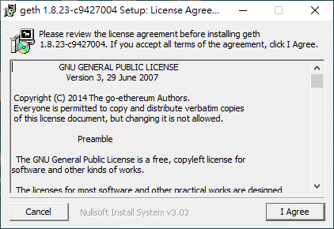
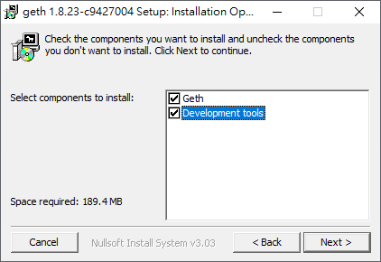

##施工中......

# Windows系統-Geth PoA 私有鏈架設筆記
# 環境

- Windows 專業版 x64
- Geth v1.8.23

# 下載、安裝
## 下載

下載很簡單，直接到 [Go Ethereum官網](https://geth.ethereum.org/downloads/)下載就行了。
請選擇自己的作業系統來下載。我自己下載了Windows版 v1.8.23。

##安裝

下載完後，執行下載下來的安裝檔。

Step1. 點選 I agree  
  
Step2. 將 Geth 與 Development Tools打勾並按 Next  
  
Step3. 選擇安裝路徑。我這邊直接選擇預設路徑。完成後按Install 開始安裝  
  

