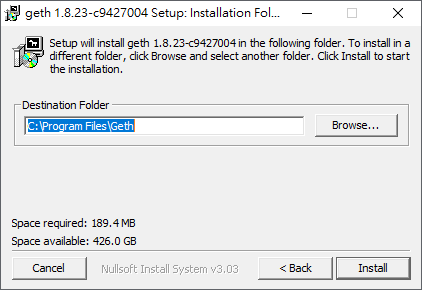

# Windows系統-Geth PoA 私有鏈架設筆記
# 環境

- Windows 10 專業版 x64
- Geth v1.8.23

# 下載、安裝
## 下載

下載很簡單，直接到 [Go Ethereum官網](https://geth.ethereum.org/downloads/)下載就行了。  
請選擇自己的作業系統來下載。我自己下載了Windows版 v1.8.23。

## 安裝

下載完後，執行下載下來的安裝檔。

Step1. 點選 I agree    
  

Step2. 將 Geth 與 Development Tools打勾並按 Next  
  

Step3. 選擇安裝路徑。我這邊直接選擇預設路徑。完成後按Install 開始安裝  
  

## 確認版本

開啟命令提示字元(以系統管理員身分執行)，並輸入指令：`geth version` 來看GETH的版本資訊 

```
C:\>geth version      # 會顯示出GETH的版本資訊
Geth
Version: 1.8.23-stable
Git Commit: c942700427557e3ff6de3aaf6b916e2f056c1ec2
Architecture: amd64
Protocol Versions: [63 62]
Network Id: 1
Go Version: go1.11.5
Operating System: windows
GOPATH=
GOROOT=C:\go
```

## 建立存放區塊鏈資料的資料夾

為了方便我們在C槽底下建立一個資料夾，我自己取名叫node。  

# 建立以太坊帳戶

現在要來建立以太坊的帳戶，先將命令提示字元切換到C槽底下並輸入指令：`geth --datadir node account new`來建立帳戶。輸入完指令後會要求輸入密碼，並要求再輸入一次密碼做確認。都輸入完之後就會產生一個以太坊的帳戶。    

```
c:\>geth --datadir node account new
INFO [03-25|16:57:09.744] Maximum peer count                       ETH=25 LES=0 total=25
Your new account is locked with a password. Please give a password. Do not forget this password.
Passphrase:
Repeat passphrase:
Address: {4b5d920a41e2c6b07cc422f66d4f9e8177530ae1}
```

指令`--datadir`後面接的值為儲存區塊鏈資料與帳戶keystore的資料夾。  

# 使用puppeth來建立PoA私有鏈的Genesis檔案

接下來我們要來使用Geth裡面的開發工具**puppeth**來進行PoA私有鏈的創世區塊檔案。  
在命令提示字元輸入`puppeth`，它會要求輸入一個網路的名稱。想取什麼都可以，我自己取名為poa。  
```
c:\>puppeth
+-----------------------------------------------------------+
| Welcome to puppeth, your Ethereum private network manager |
|                                                           |
| This tool lets you create a new Ethereum network down to  |
| the genesis block, bootnodes, miners and ethstats servers |
| without the hassle that it would normally entail.         |
|                                                           |
| Puppeth uses SSH to dial in to remote servers, and builds |
| its network components out of Docker containers using the |
| docker-compose toolset.                                   |
+-----------------------------------------------------------+

Please specify a network name to administer (no spaces, hyphens or capital letters please)
> poa

Sweet, you can set this via --network=poa next time!

[32mINFO [0m[03-25|17:45:55.524] Administering Ethereum network           [32mname[0m=poa
[33mWARN [0m[03-25|17:45:55.553] No previous configurations found         [33mpath[0m=.puppeth\\poa
```
接著這邊要選擇2，來建立一個創世區塊檔  
```
What would you like to do? (default = stats)
 1. Show network stats
 2. Configure new genesis
 3. Track new remote server
 4. Deploy network components
> 2
```
然後這邊選擇1，從0開始建立一個genesis檔  
```
What would you like to do? (default = create)
 1. Create new genesis from scratch
 2. Import already existing genesis
> 1
```
選擇要使用的共識演算法，這邊我們選擇2 **Clique-PoA**  
```
Which consensus engine to use? (default = clique)
 1. Ethash - proof-of-work
 2. Clique - proof-of-authority
> 2
```
接下來要來設定區塊產生的時間，預設為15秒。我這邊也設成跟預設相同。
```
How many seconds should blocks take? (default = 15)
> 15
```
這裡要指定一個帳戶來做為授權打包的角色，把我們剛剛建立帳戶位置貼上去。  
可以指定多個帳戶，這邊我們只指定一個帳戶作為打包的角色。  
```
Which accounts are allowed to seal? (mandatory at least one)
> 0x4b5d920a41e2c6b07cc422f66d4f9e8177530ae1
> 0x
```
同樣的，這邊輸入我們建立的帳戶上去，使帳戶裡面事先擁有一些ether。   
```
Which accounts should be pre-funded? (advisable at least one)
> 0x4b5d920a41e2c6b07cc422f66d4f9e8177530ae1
> 0x
```
接著會問你是否要將precompile-addresses配置1 wei。  
推薦是使用yes，由於不是很懂這次就先不要。
關於**precompile-addresses**以及這個message要做什麼  
可以參考[此連結](https://ethereum.stackexchange.com/questions/68056/puppeth-precompile-addresses?rq=1)  
```
Should the precompile-addresses (0x1 .. 0xff) be pre-funded with 1 wei? (advisable yes)
> no
```
輸入你的網路ID，我這邊設置為15   
```
Specify your chain/network ID if you want an explicit one (default = random)
> 15
[32mINFO [0m[03-25|18:19:31.099] Configured new genesis block
```
### 網路ID:   
以下簡單介紹幾個常看到的網路ID:   
沒列舉到的部分，可以透過下方資料來源去觀看。  

| ID | chain                         |
|----|-------------------------------|
| 0  | Olympic (disused)             |
| 1  | Frontier (now mainnet)        |
| 2  | Morden (disused)              |
| 3  | Ropsten (current PoW testnet) |
| 4  | Rinkeby (current Geth PoA testnet) |
| 5  | Goerli  (cross-client PoA testnet) |

資料來源:  
[Ethereum Wire Protocol (ETH)](https://github.com/ethereum/devp2p/blob/master/caps/eth.md#newblockhashes-0x01)、[How to select a network id or is there a list of network ids?](https://ethereum.stackexchange.com/questions/17051/how-to-select-a-network-id-or-is-there-a-list-of-network-ids)  

這邊兩個都選擇2來進行檔案的輸出   
```
What would you like to do? (default = stats)
 1. Show network stats
 2. Manage existing genesis
 3. Track new remote server
 4. Deploy network components
> 2  

 1. Modify existing fork rules
 2. Export genesis configurations
 3. Remove genesis configuration
> 2
```
之後會問你要儲存在哪個資料夾中，直接按Enter直接幫你新增在當前資料夾中。  
```
Which folder to save the genesis specs into? (default = current)
  Will create poa.json, poa-aleth.json, poa-harmony.json, poa-parity.json
>
[32mINFO [0m[03-26|10:45:07.727] Saved native genesis chain spec          [32mpath[0m=poa.json
[31mERROR[0m[03-26|10:45:07.727] Failed to create Aleth chain spec        [31merr[0m="unsupported consensus engine"
[31mERROR[0m[03-26|10:45:07.728] Failed to create Parity chain spec       [31merr[0m="unsupported consensus engine"
[32mINFO [0m[03-26|10:45:07.729] Saved genesis chain spec                 [32mclient[0m=harmony [32mpath[0m=poa-harmony.json
```
完成後會跳會下面這個訊息，直接按`Ctrl + C`離開。
```
What would you like to do? (default = stats)
 1. Show network stats
 2. Manage existing genesis
 3. Track new remote server
 4. Deploy network components
> [35mCRIT [0m[03-26|10:49:18.413] Failed to read user input               [35merr[0m=EOF
```
# 生成的poa.json檔
可以用記事本來開啟新建的poa.json檔，內容如下
```
{
  "config": {
    "chainId": 15,
    "homesteadBlock": 1,
    "eip150Block": 2,
    "eip150Hash": "0x0000000000000000000000000000000000000000000000000000000000000000",
    "eip155Block": 3,
    "eip158Block": 3,
    "byzantiumBlock": 4,
    "constantinopleBlock": 5,
    "clique": {
      "period": 15,
      "epoch": 30000
    }
  },
  "nonce": "0x0",
  "timestamp": "0x5c98a556",
  "extraData": "0x00000000000000000000000000000000000000000000000000000000000000004b5d920a41e2c6b07cc422f66d4f9e8177530ae10000000000000000000000000000000000000000000000000000000000000000000000000000000000000000000000000000000000000000000000000000000000",
  "gasLimit": "0x47b760",
  "difficulty": "0x1",
  "mixHash": "0x0000000000000000000000000000000000000000000000000000000000000000",
  "coinbase": "0x0000000000000000000000000000000000000000",
  "alloc": {
    "4b5d920a41e2c6b07cc422f66d4f9e8177530ae1": {
      "balance": "0x200000000000000000000000000000000000000000000000000000000000000"
    }
  },
  "number": "0x0",
  "gasUsed": "0x0",
  "parentHash": "0x0000000000000000000000000000000000000000000000000000000000000000"
}
```
主要要注意的地方是chainID與alloc的部分，`chainID`代表區塊鏈的網路號碼，而`alloc與ballance`代表要配置Ether(以太幣)的帳戶與以太幣數量。  

# 建立創世區塊
輸入指令`geth --datadir node init poa.json`來進行創世區塊的初始化  

```
c:\>geth --datadir node init poa.json
INFO [03-26|11:09:13.007] Maximum peer count                       ETH=25 LES=0 total=25
INFO [03-26|11:09:13.036] Allocated cache and file handles         database=c:\\node\\geth\\chaindata cache=16 handles=16
INFO [03-26|11:09:13.048] Writing custom genesis block
INFO [03-26|11:09:13.049] Persisted trie from memory database      nodes=1 size=172.00B time=0s gcnodes=0 gcsize=0.00B gctime=0s livenodes=1 livesize=0.00B
INFO [03-26|11:09:13.053] Successfully wrote genesis state         database=chaindata                 hash=43628c…9cd596
INFO [03-26|11:09:13.056] Allocated cache and file handles         database=c:\\node\\geth\\lightchaindata cache=16 handles=16
INFO [03-26|11:09:13.063] Writing custom genesis block
INFO [03-26|11:09:13.066] Persisted trie from memory database      nodes=1 size=172.00B time=998.1µs gcnodes=0 gcsize=0.00B gctime=0s livenodes=1 livesize=0.00B
INFO [03-26|11:09:13.069] Successfully wrote genesis state         database=lightchaindata                 hash=43628c…9cd596
```
成功後node資料夾裡面就會出現名為**geth**的資料夾  
  

# 啟動geth服務

輸入指令  
`geth --datadir node --nodiscover --networkid 15 --port 30001 --rpc --rpcport 8545 console`
```
c:\>geth --datadir node --nodiscover --networkid 15 --port 30001 --rpc --rpcport 8545 console
INFO [03-26|12:05:39.684] Maximum peer count                       ETH=25 LES=0 total=25
INFO [03-26|12:05:39.711] Starting peer-to-peer node               instance=Geth/v1.8.23-stable-c9427004/windows-amd64/go1.11.5
INFO [03-26|12:05:39.714] Allocated cache and file handles         database=c:\\node\\geth\\chaindata cache=512 handles=8192
INFO [03-26|12:05:39.733] Initialised chain configuration          config="{ChainID: 15 Homestead: 1 DAO: <nil> DAOSupport: false EIP150: 2 EIP155: 3 EIP158: 3 Byzantium: 4 Constantinople: 5  ConstantinopleFix: <nil> Engine: clique}"
INFO [03-26|12:05:39.737] Initialising Ethereum protocol           versions="[63 62]" network=15
INFO [03-26|12:05:39.775] Loaded most recent local header          number=0 hash=43628c…9cd596 td=1 age=18h11m9s
INFO [03-26|12:05:39.778] Loaded most recent local full block      number=0 hash=43628c…9cd596 td=1 age=18h11m9s
INFO [03-26|12:05:39.781] Loaded most recent local fast block      number=0 hash=43628c…9cd596 td=1 age=18h11m9s
INFO [03-26|12:05:39.783] Loaded local transaction journal         transactions=0 dropped=0
INFO [03-26|12:05:39.786] Regenerated local transaction journal    transactions=0 accounts=0
INFO [03-26|12:05:39.799] New local node record                    seq=8 id=7b263cac7915640c ip=127.0.0.1 udp=0 tcp=30001
INFO [03-26|12:05:39.802] Started P2P networking                   self="enode://52fa0a6eb4af2303d282002258498fc0b5dfbfcee4e0a990342e08f54d203f7281d52e56ef070ec168430ce1aac83a43cf9e80b0f56b0272b516b5bae4957138@127.0.0.1:30001?discport=0"
INFO [03-26|12:05:39.800] IPC endpoint opened                      url=\\\\.\\pipe\\geth.ipc
INFO [03-26|12:05:39.807] HTTP endpoint opened                     url=http://127.0.0.1:8545 cors= vhosts=localhost
Welcome to the Geth JavaScript console!

instance: Geth/v1.8.23-stable-c9427004/windows-amd64/go1.11.5
INFO [03-26|12:05:39.869] Etherbase automatically configured       address=0x4b5d920a41e2C6b07CC422f66D4f9e8177530aE1
coinbase: 0x4b5d920a41e2c6b07cc422f66d4f9e8177530ae1
at block: 0 (Mon, 25 Mar 2019 17:54:30 CST)
 datadir: c:\node
 modules: admin:1.0 clique:1.0 debug:1.0 eth:1.0 miner:1.0 net:1.0 personal:1.0 rpc:1.0 txpool:1.0 web3:1.0

>
```
## 顯示帳戶餘額
命令提示字元輸入指令`eth.getBalance(eth.accounts[0])`來取得帳戶餘額  
```
> eth.getBalance(eth.accounts[0])
9.04625697166532776746648320380374280103671755200316906558262375061821325312e+74
```
## 確認節點訊息
輸入指令`admin.nodeInfo.enode`來取的節點資訊
```
> admin.nodeInfo.enode
"enode://52fa0a6eb4af2303d282002258498fc0b5dfbfcee4e0a990342e08f54d203f7281d52e56ef070ec168430ce1aac83a43cf9e80b0f56b0272b516b5bae4957138@127.0.0.1:30001?discport=0"
```

# 多節點架設

要進行多節點的架設，步驟跟前述的一樣。需要安裝geth、建立帳戶、初始化創世區塊。  
不過要進行多個節點的連結，創世區塊是要一樣的，所以我們把建立好的`poa.json`複製到第二台機器上。  
並同樣的在C槽建立一個存放資料的資料夾。我這邊取名為node2。  
一樣輸入指令`geth --datadir node2 init poa.json`來進行初始化。  
```
c:\>geth --datadir node2 init poa.json
INFO [03-26|11:53:54.100] Maximum peer count                       ETH=25 LES=0 total=25
INFO [03-26|11:53:54.148] Allocated cache and file handles         database=c:\\node2\\geth\\chaindata cache=16 handles=16
INFO [03-26|11:53:54.328] Writing custom genesis block
INFO [03-26|11:53:54.331] Persisted trie from memory database      nodes=1 size=172.00B time=0s gcnodes=0 gcsize=0.00B gctime=0s livenodes=1 livesize=0.00B
INFO [03-26|11:53:54.337] Successfully wrote genesis state         database=chaindata                  hash=43628c…9cd596
INFO [03-26|11:53:54.341] Allocated cache and file handles         database=c:\\node2\\geth\\lightchaindata cache=16 handles=16
INFO [03-26|11:53:54.397] Writing custom genesis block
INFO [03-26|11:53:54.401] Persisted trie from memory database      nodes=1 size=172.00B time=0s gcnodes=0 gcsize=0.00B gctime=0s livenodes=1 livesize=0.00B
INFO [03-26|11:53:54.408] Successfully wrote genesis state         database=lightchaindata                  hash=43628c …9cd596
```
## 啟動節點二的geth服務
同樣的輸入指令`geth --datadir node2 --nodiscover --networkid 15 --port 30002 --rpc --rpcport 8545 console`
```
c:\>geth --datadir node2 --nodiscover --networkid 15 --port 30002 --rpc --rpcport 8545 console
INFO [03-26|12:23:28.702] Maximum peer count                       ETH=25 LES=0 total=25
INFO [03-26|12:23:28.751] Starting peer-to-peer node               instance=Geth/v1.8.23-stable-c9427004/windows-amd64/go1.11.5
INFO [03-26|12:23:28.757] Allocated cache and file handles         database=c:\\node2\\geth\\chaindata cache=512 handles=8192
INFO [03-26|12:23:28.880] Initialised chain configuration          config="{ChainID: 15 Homestead: 1 DAO: <nil> DAOSupport: false EIP150: 2 EIP155: 3 EIP158: 3 Byzantium: 4 Constantinople: 5  ConstantinopleFix: <nil> Engine: clique}"
INFO [03-26|12:23:28.888] Initialising Ethereum protocol           versions="[63 62]" network=15
INFO [03-26|12:23:28.958] Loaded most recent local header          number=0 hash=43628c…9cd596 td=1 age=18h28m58s
INFO [03-26|12:23:28.963] Loaded most recent local full block      number=0 hash=43628c…9cd596 td=1 age=18h28m58s
INFO [03-26|12:23:28.967] Loaded most recent local fast block      number=0 hash=43628c…9cd596 td=1 age=18h28m58s
INFO [03-26|12:23:28.972] Regenerated local transaction journal    transactions=0 accounts=0
INFO [03-26|12:23:28.975] Stored checkpoint snapshot to disk       number=0 hash=43628c…9cd596
INFO [03-26|12:23:29.049] New local node record                    seq=1 id=12103e4a8d5b9ac4 ip=127.0.0.1 udp=0 tcp=30002
INFO [03-26|12:23:29.058] Started P2P networking                   self="enode://7ac3c5fc0d04324915b9376258e4a211c560271b6a25854177d899de29e377be4286ca1df867f2b0aa31eb2f06f80a039067fcb5981442447479c2115ad080d3@127.0.0.1:30002?discport=0"
INFO [03-26|12:23:29.050] IPC endpoint opened                      url=\\\\.\\pipe\\geth.ipc
INFO [03-26|12:23:29.075] HTTP endpoint opened                     url=http://127.0.0.1:8545 cors= vhosts=localhost
Welcome to the Geth JavaScript console!

instance: Geth/v1.8.23-stable-c9427004/windows-amd64/go1.11.5
INFO [03-26|12:23:29.158] Etherbase automatically configured       address=0x7191d9C4590C82418F6feFdA0da8D0Bc10Eea974
coinbase: 0x7191d9c4590c82418f6fefda0da8d0bc10eea974
at block: 0 (Mon, 25 Mar 2019 17:54:30 CST)
 datadir: c:\node2
 modules: admin:1.0 clique:1.0 debug:1.0 eth:1.0 miner:1.0 net:1.0 personal:1.0 rpc:1.0 txpool:1.0 web3:1.0

>
```
## 取得節點二的節點資訊
一樣輸入指令`admin.nodeInfo.enode`來取得資訊  
```
> admin.nodeInfo.enode
"enode://7ac3c5fc0d04324915b9376258e4a211c560271b6a25854177d899de29e377be4286ca1df867f2b0aa31eb2f06f80a039067fcb5981442447479c2115ad080d3@127.0.0.1:30002?discport=0"
```
# 連結兩個節點
## 節點一
首先將節點一的geth服務關閉，輸入指令`exit()`來關閉服務，並重新輸入指令`geth --datadir node --nodiscover --syncmode "full" --networkid 15 --port 30001 --rpc --rpcport 8545 console`  
增加syncmode參數是為了多節點區塊同步設定的。  
## 節點二
同樣的將節點二也新增syncmode參數重啟。
`geth --datadir node2 --nodiscover --syncmode "full" --networkid 15 --port 30002 --rpc --rpcport 8545 console`
## 使用admin.addPeer()方式新增節點
在節點一的命令提示字元輸入`admin.addPeer("enode://7ac3c5fc0d04324915b9376258e4a211c560271b6a25854177d899de29e377be4286ca1df867f2b0aa31eb2f06f80a039067fcb5981442447479c2115ad080d3@Node2 IP Address:30002?discport=0")`

`@Node2 IP Address:30002`的部分，IP請輸入電腦IP位置  
```
> admin.addPeer("enode://7ac3c5fc0d04324915b9376258e4a211c560271b6a25854177d899de29e377be4286ca1df867f2b0aa31eb2f06f80a039067fcb5981442447479c2115ad080d3@Node2 IP Address:30002?discport=0")
true
```
然後再輸入`admin.peers`就可以看到連結的狀況了  
```
> admin.peers

[{
    caps: ["eth/62", "eth/63"],
    enode: "enode://7ac3c5fc0d04324915b9376258e4a211c560271b6a25854177d899de29e377be4286ca1df867f2b0aa31eb2f06f80a039067fcb5981442447479c2115ad080d3@Node 2 IP Address:30002?discport=0",
    id: "12103e4a8d5b9ac40b44cf703dbc1d0302141e61d952837246024b085c27b754",
    name: "Geth/v1.8.23-stable-c9427004/windows-amd64/go1.11.5",
    network: {
      inbound: false,
      localAddress: "Node IP Address:62845",
      remoteAddress: "Node2 IP Address:30002",
      static: true,
      trusted: false
    },
    protocols: {
      eth: {
        difficulty: 1,
        head: "0x43628c7e28cf98925c630d32645049664422477dddf4394aa0b86eba5c9cd596",
        version: 63
      }
    }
}]
>
```
若新增失敗，可以將geth應用程式加入防火牆再試試看。  
# 挖礦
為了要挖礦，我們要來解鎖帳戶才能進行挖礦的動作。先將節點一的geth服務停止並在node資料夾新增一個txt檔案。  
我們取名為password，來存放我們的帳戶密碼。  
並輸入指令`geth --datadir node --nodiscover --syncmode "full" --networkid 15 --port 30001 --rpc --rpcport 8545 --unlock "4b5d920a41e2c6b07cc422f66d4f9e8177530ae1" --password C:/node/password.txt console`  
然後一樣再連接節點二，然後輸入指令`miner.start()`就可以開始挖礦了  
這時候就可以看到節點一開始挖礦了，節點二也會跟著同步資訊。  
節點一:  
  
節點二:  

如果想要停止挖礦，只要輸入`miner.stop()`就可以了  
```
> miner.stop()
null
```
# 相關參考連結
- [Geth console 指令](https://github.com/ethereum/go-ethereum/wiki/JavaScript-Console)
- [Command Line 指令](https://github.com/ethereum/go-ethereum/wiki/Command-Line-Options)
- [Go-Ethereum Github](https://github.com/ethereum/go-ethereum)
